# 🚀 Production-Ready k3d Kubernetes Platform

Complete enterprise-grade Kubernetes development platform powered by k3d, featuring Istio service mesh, comprehensive observability, and GitOps automation.


## 🏗️ Architecture Overview

```mermaid
graph TB
    subgraph External["🌍 External Access Layer"]
        Users[👥 External Users]
        DNS[🌐 DNS Resolution<br/>demo.ecotrack.local]
        LB[🔗 MetalLB LoadBalancer<br/>172.18.255.200]
    end

    subgraph Ingress["🚪 Ingress & Traffic Management"]
        NGINX[🌐 NGINX Ingress<br/>TLS Termination]
        IstioGW[🕸️ Istio Gateway<br/>Traffic Routing]
        CertMgr[🔐 Cert-Manager<br/>Auto TLS renewal]
    end

    subgraph ServiceMesh["🕸️ Service Mesh Layer"]
        Istiod[Istiod<br/>Config Management]
        EnvoyProxy[📡 Envoy Sidecars<br/>mTLS Encryption]
    end

    subgraph AppLayer["🎯 Application Layer"]
        DemoApp[🎯 Demo Service]
        UserSvc[👤 User Service]
        CarbonSvc[🌱 Carbon Tracking]
        AnalyticsSvc[📊 Analytics Service]
    end

    subgraph DataLayer["🗄️ Data Services"]
        PostgreSQL[🐘 PostgreSQL<br/>Primary Database]
        Redis[🔴 Redis<br/>Cache & Sessions]
        Kafka[📨 Kafka<br/>Event Streaming]
    end

    subgraph ObsLayer["📊 Observability"]
        Prometheus[📈 Prometheus<br/>Metrics]
        Grafana[📊 Grafana<br/>Dashboards]
        Jaeger[🔎 Jaeger<br/>Tracing]
        Kiali[🔍 Kiali<br/>Service Mesh]
    end

    Users --> DNS --> LB --> NGINX --> IstioGW
    IstioGW --> AppLayer
    Istiod -.-> EnvoyProxy
    AppLayer --> DataLayer
    EnvoyProxy -.-> ObsLayer

    classDef external fill:#e1f5fe,stroke:#01579b,stroke-width:2px
    classDef ingress fill:#f3e5f5,stroke:#4a148c,stroke-width:2px
    classDef mesh fill:#fff3e0,stroke:#e65100,stroke-width:2px
    classDef apps fill:#e8f5e8,stroke:#1b5e20,stroke-width:2px
    classDef data fill:#fce4ec,stroke:#880e4f,stroke-width:2px
    classDef obs fill:#e0f2f1,stroke:#004d40,stroke-width:2px
    
    class Users,DNS,LB external
    class NGINX,IstioGW,CertMgr ingress
    class Istiod,EnvoyProxy mesh
    class DemoApp,UserSvc,CarbonSvc,AnalyticsSvc apps
    class PostgreSQL,Redis,Kafka data
    class Prometheus,Grafana,Jaeger,Kiali obs
```



## 🚀 Quick Start

### Prerequisites
- Docker Desktop or equivalent
- kubectl
- Helm 3.x
- k3d

### 1. Deploy Complete Platform
```bash
# Clone the repository
git clone https://github.com/jmcastellanojimenez/ecotrack-platform.git
cd ecotrack-platform

# Deploy the complete platform
./scripts/deploy-platform.sh

# Setup local DNS
echo "172.18.255.200 demo.ecotrack.local grafana.ecotrack.local kiali.ecotrack.local jaeger.ecotrack.local" >> /etc/hosts
```

### 2. Access Services
```bash
# Demo Application
open https://demo.ecotrack.local

# Grafana (admin / ecotrack-admin)
kubectl port-forward -n monitoring svc/monitoring-grafana 3000:80

# Prometheus
kubectl port-forward -n monitoring svc/monitoring-kube-prometheus-prometheus 9090:9090

# Kiali (Service Mesh)
kubectl port-forward -n istio-system svc/kiali 20001:20001

# Jaeger (Distributed Tracing)
kubectl port-forward -n istio-system svc/jaeger 16686:16686

# ArgoCD (GitOps)
kubectl port-forward -n argocd svc/argocd-server 8080:80
```

## 📁 Repository Structure

```
ecotrack-platform/
├── README.md
├── docs/                           # Documentation
│   ├── architecture/               # Architecture diagrams and docs
│   ├── deployment/                 # Deployment guides
│   ├── development/                # Development guides
│   └── operations/                 # Operations runbooks
├── infrastructure/                 # Infrastructure as Code
│   ├── k3d/                       # k3d cluster configurations
│   ├── helm-charts/               # Custom Helm charts
│   └── terraform/                 # Terraform modules (future)
├── platform/                      # Platform services
│   ├── ingress/                   # Ingress controllers and configs
│   ├── service-mesh/              # Istio configurations
│   ├── observability/             # Monitoring and logging
│   ├── data-services/             # PostgreSQL, Redis, Kafka
│   └── security/                  # Security policies and configs
├── applications/                   # EcoTrack microservices
│   ├── demo-app/                  # Demo application
│   ├── user-service/              # User management service
│   ├── carbon-tracking/           # Carbon footprint tracking
│   ├── analytics-service/         # Analytics and reporting
│   └── api-gateway/               # API Gateway service
├── gitops/                        # GitOps configurations
│   ├── argocd/                    # ArgoCD applications
│   ├── environments/              # Environment-specific configs
│   └── policies/                  # Governance policies
├── scripts/                       # Automation scripts
│   ├── deploy-platform.sh         # Complete platform deployment
│   ├── setup-cluster.sh           # Cluster setup
│   ├── install-components.sh      # Component installation
│   └── utilities/                 # Utility scripts
├── monitoring/                     # Monitoring configurations
│   ├── prometheus/                # Prometheus configs
│   ├── grafana/                   # Grafana dashboards
│   ├── jaeger/                    # Jaeger tracing configs
│   └── alerts/                    # Alerting rules
├── .github/                       # GitHub workflows
│   └── workflows/                 # CI/CD pipelines
├── examples/                      # Example configurations
│   ├── microservice-template/     # Microservice template
│   └── deployment-patterns/       # Deployment examples
└── tests/                         # Integration tests
    ├── platform/                  # Platform tests
    └── e2e/                      # End-to-end tests
```

## 🏗️ Platform Components

### Core Infrastructure
- **k3d Kubernetes Cluster**: Lightweight Kubernetes for development
- **MetalLB**: Load balancer for on-premises clusters
- **NGINX Ingress**: HTTP/HTTPS load balancing and SSL termination
- **Cert-Manager**: Automatic TLS certificate management

### Service Mesh
- **Istio**: Complete service mesh solution
- **Envoy Proxies**: Sidecar proxies for all services
- **mTLS**: Mutual TLS for service-to-service communication
- **Traffic Management**: Circuit breaking, retries, load balancing

### Data Layer
- **PostgreSQL**: Primary database with persistent storage
- **Redis**: In-memory cache and session store
- **Kafka + ZooKeeper**: Event streaming and message broker

### Observability
- **Prometheus**: Metrics collection and alerting
- **Grafana**: Visualization and dashboards
- **Jaeger**: Distributed tracing
- **Kiali**: Service mesh observability

### GitOps & Deployment
- **ArgoCD**: Continuous deployment and GitOps
- **Helm**: Package management
- **Custom Controllers**: Application lifecycle management

## 🔐 Security Features

- **Mutual TLS (mTLS)**: Automatic encryption between all services
- **Certificate Management**: Automatic certificate provisioning and rotation
- **Network Policies**: Kubernetes network segmentation
- **RBAC**: Role-based access control
- **Security Policies**: Istio security policies
- **Secret Management**: Kubernetes secrets and external secret management

## 📊 Monitoring & Observability

### Metrics
- **Infrastructure metrics**: Node, pod, and container metrics
- **Application metrics**: Business KPIs and technical metrics
- **Service mesh metrics**: Request rates, latencies, error rates

### Tracing
- **Distributed tracing**: Request flow across microservices
- **Performance analysis**: Latency breakdown and bottleneck identification
- **Error tracking**: Exception tracking and debugging

### Logging
- **Centralized logging**: Aggregated logs from all services
- **Log analysis**: Search, filtering, and alerting on logs
- **Audit trails**: Security and compliance logging

## 🔄 GitOps Workflow

1. **Code Push**: Developers push code to feature branches
2. **CI Pipeline**: Automated testing and container building
3. **ArgoCD Sync**: Automatic deployment to target environments
4. **Health Checks**: Automated health and readiness checks
5. **Rollback**: Automatic rollback on deployment failures

## 🎯 Getting Started with Development

### Deploy a New Microservice
```bash
# Use the microservice template
cp -r examples/microservice-template applications/my-service

# Customize the service
cd applications/my-service
# Edit configurations in k8s/ directory

# Deploy via ArgoCD
kubectl apply -f gitops/argocd/applications/my-service.yaml
```

### Local Development
```bash
# Start local development environment
./scripts/dev-setup.sh

# Port forward to services
kubectl port-forward svc/my-service 8080:80

# View logs
kubectl logs -f deployment/my-service
```

## 🛠️ Operations

### Platform Management
```bash
# Check platform status
./scripts/platform-status.sh

# Upgrade platform components
./scripts/upgrade-platform.sh

# Backup data services
./scripts/backup-data.sh
```

### Troubleshooting
```bash
# Debug service mesh issues
kubectl get vs,gw,dr -A

# Check certificate status
kubectl get certificates -A

# View ArgoCD sync status
argocd app list
```

## 📈 Scaling

### Horizontal Scaling
- **HPA**: Horizontal Pod Autoscaler for applications
- **Cluster Autoscaler**: Node scaling based on resource requirements
- **Load Balancing**: Automatic traffic distribution

### Vertical Scaling
- **VPA**: Vertical Pod Autoscaler for resource optimization
- **Resource Limits**: Optimized resource allocation
- **Performance Tuning**: Application and infrastructure optimization

## 🧪 Testing

### Integration Tests
```bash
# Run platform integration tests
./scripts/run-tests.sh

# Test service mesh connectivity
./tests/service-mesh-tests.sh

# Validate observability stack
./tests/observability-tests.sh
```

### Performance Testing
```bash
# Load testing
./tests/performance/load-test.sh

# Stress testing
./tests/performance/stress-test.sh
```

## 🤝 Contributing

1. Fork the repository
2. Create a feature branch (`git checkout -b feature/amazing-feature`)
3. Commit your changes (`git commit -m 'Add amazing feature'`)
4. Push to the branch (`git push origin feature/amazing-feature`)
5. Open a Pull Request

## 📄 License

This project is licensed under the MIT License - see the [LICENSE](LICENSE) file for details.

## 🙋‍♂️ Support

- **Documentation**: Check the `/docs` directory for detailed guides
- **Issues**: Report bugs and request features via GitHub Issues
- **Discussions**: Join the conversation in GitHub Discussions
- **Wiki**: Additional information in the project Wiki

## 🔗 Useful Links

- [Kubernetes Documentation](https://kubernetes.io/docs/)
- [Istio Documentation](https://istio.io/latest/docs/)
- [ArgoCD Documentation](https://argo-cd.readthedocs.io/)
- [Prometheus Documentation](https://prometheus.io/docs/)
- [Grafana Documentation](https://grafana.com/docs/)

---

🚀 **Built with k3d for fast, lightweight Kubernetes development**