# 🏗️ EcoTrack Platform Architecture

This document provides a comprehensive overview of the EcoTrack platform architecture, including all components, data flows, and operational patterns.

## 📊 High-Level Architecture

```mermaid
graph TB
    subgraph External["🌍 External Access Layer"]
        Users[👥 External Users]
        DNS[🌐 DNS Resolution<br/>demo.ecotrack.local<br/>grafana.ecotrack.local<br/>kiali.ecotrack.local]
        LB[🔗 MetalLB LoadBalancer<br/>172.18.255.200]
    end

    subgraph Ingress["🚪 Ingress & Traffic Management"]
        NGINX[🌐 NGINX Ingress<br/>TLS Termination<br/>L7 Routing]
        IstioGW[🕸️ Istio Gateway<br/>Traffic Routing<br/>Virtual Services]
        CertMgr[🔐 Cert-Manager<br/>Self-signed CA<br/>Auto TLS renewal]
    end

    subgraph ServiceMesh["🕸️ Service Mesh Layer"]
        Istiod[Istiod<br/>Config Management<br/>Service Discovery]
        EnvoyProxy[📡 Envoy Sidecars<br/>mTLS Encryption<br/>Circuit Breaking<br/>Traffic Metrics]
    end

    subgraph AppLayer["🎯 Application Layer"]
        DemoApp[🎯 Demo Service]
        UserSvc[👤 User Service]
        CarbonSvc[🌱 Carbon Tracking]
        AnalyticsSvc[📊 Analytics Service]
        AuthSvc[🔐 Auth Service]
        APISvc[🚪 API Gateway]
    end

    subgraph DataLayer["🗄️ Data Services"]
        PostgreSQL[🐘 PostgreSQL<br/>Primary Database<br/>3GB Storage]
        Redis[🔴 Redis<br/>Cache & Sessions<br/>1GB Storage]
        Kafka[📨 Kafka<br/>Event Streaming<br/>2GB Storage]
    end

    subgraph ObsLayer["📊 Observability"]
        Prometheus[📈 Prometheus<br/>Metrics Collection<br/>2GB Storage]
        Grafana[📊 Grafana<br/>Dashboards<br/>1GB Storage]
        Jaeger[🔎 Jaeger<br/>Distributed Tracing]
        Kiali[🔍 Kiali<br/>Service Mesh Topology]
    end

    subgraph GitOpsLayer["🔄 GitOps"]
        ArgoCD[🔄 ArgoCD<br/>Continuous Deployment]
        RepoServer[📚 Repository Server]
        AppController[📱 App Controller]
    end

    Users --> DNS --> LB --> NGINX
    LB --> IstioGW
    NGINX --> AppLayer
    IstioGW --> AppLayer
    CertMgr -.-> NGINX
    CertMgr -.-> IstioGW
    
    Istiod -.-> EnvoyProxy
    EnvoyProxy -.-> AppLayer
    AppLayer --> DataLayer
    EnvoyProxy -.-> ObsLayer
    
    GitOpsLayer -.-> AppLayer

    classDef external fill:#e1f5fe,stroke:#01579b,stroke-width:2px
    classDef ingress fill:#f3e5f5,stroke:#4a148c,stroke-width:2px
    classDef mesh fill:#fff3e0,stroke:#e65100,stroke-width:2px
    classDef apps fill:#e8f5e8,stroke:#1b5e20,stroke-width:2px
    classDef data fill:#fce4ec,stroke:#880e4f,stroke-width:2px
    classDef obs fill:#e0f2f1,stroke:#004d40,stroke-width:2px
    classDef gitops fill:#fff8e1,stroke:#f57f17,stroke-width:2px
    
    class Users,DNS,LB external
    class NGINX,IstioGW,CertMgr ingress
    class Istiod,EnvoyProxy mesh
    class DemoApp,UserSvc,CarbonSvc,AnalyticsSvc,AuthSvc,APISvc apps
    class PostgreSQL,Redis,Kafka data
    class Prometheus,Grafana,Jaeger,Kiali obs
    class ArgoCD,RepoServer,AppController gitops
```

## 🔗 Service Communication Flow

```mermaid
sequenceDiagram
    participant User as 👥 User
    participant LB as 🔗 LoadBalancer
    participant NGINX as 🌐 NGINX
    participant Gateway as 🕸️ Gateway
    participant Envoy as 📡 Envoy
    participant App as 🎯 App
    participant DB as 🐘 Database
    participant Metrics as 📈 Prometheus
    participant Traces as 🔎 Jaeger

    User->>+LB: HTTPS Request
    LB->>+NGINX: Forward Request
    NGINX->>+Gateway: Route to Istio
    Gateway->>+Envoy: Apply Traffic Rules
    
    Note over Envoy: mTLS Authentication<br/>Circuit Breaking<br/>Load Balancing
    
    Envoy->>+App: Forward Request
    App->>+DB: Query Data
    DB-->>-App: Return Data
    App-->>-Envoy: Application Response
    
    par Observability Collection
        Envoy-->>Metrics: Send Metrics
        Envoy-->>Traces: Send Trace Data
    end
    
    Envoy-->>-Gateway: mTLS Response
    Gateway-->>-NGINX: Response
    NGINX-->>-LB: HTTPS Response
    LB-->>-User: Final Response
```

## 🏗️ Infrastructure Components

### Kubernetes Cluster (k3d)
- **Control Plane**: Single node with etcd, API server, scheduler
- **Worker Nodes**: 2 agent nodes for workload distribution
- **Container Runtime**: containerd
- **Networking**: Flannel CNI with service mesh overlay

### Load Balancing (MetalLB)
- **Type**: Layer 2 mode
- **IP Pool**: 172.18.255.200-172.18.255.250
- **Integration**: Kubernetes LoadBalancer services
- **Use Cases**: Ingress controllers, external services

### Ingress Management
- **NGINX Ingress Controller**: HTTP/HTTPS routing
- **Istio Gateway**: Service mesh ingress
- **Cert-Manager**: Automatic TLS certificate provisioning
- **DNS**: Local DNS resolution for development

## 🕸️ Service Mesh (Istio)

### Control Plane Components
- **Istiod**: Unified control plane (Pilot + Citadel + Galley)
- **Configuration**: Service discovery, traffic management
- **Security**: Certificate authority, mTLS management
- **Observability**: Telemetry collection configuration

### Data Plane Components
- **Envoy Sidecars**: Automatic injection into application pods
- **mTLS**: Mutual TLS between all services
- **Traffic Policies**: Circuit breaking, retries, timeouts
- **Load Balancing**: Round-robin, least-request algorithms

### Traffic Management
- **Virtual Services**: Request routing rules
- **Destination Rules**: Load balancing, connection pooling
- **Gateways**: External traffic ingress/egress
- **Service Entries**: External service registration

## 🗄️ Data Services Architecture

### PostgreSQL
- **Configuration**: Primary-replica setup
- **Storage**: Persistent volumes with 3GB capacity
- **Backup**: Automated backup strategies (future)
- **Connection Pooling**: PgBouncer integration (future)

### Redis
- **Mode**: Master-replica configuration
- **Use Cases**: Session storage, application cache
- **Persistence**: RDB + AOF for data durability
- **High Availability**: Sentinel for failover (future)

### Kafka
- **Cluster**: Single broker with ZooKeeper
- **Topics**: Event streaming for microservices
- **Retention**: Configurable message retention
- **Schema Registry**: Avro schema management (future)

## 📊 Observability Stack

### Metrics (Prometheus)
- **Collection**: Pull-based metrics from all services
- **Storage**: Time-series database with 7-day retention
- **Alerting**: AlertManager for notification routing
- **Service Discovery**: Kubernetes-native service discovery

### Visualization (Grafana)
- **Dashboards**: Pre-built dashboards for platform monitoring
- **Data Sources**: Prometheus, Loki (future)
- **Alerting**: Visual alerts and notifications
- **User Management**: LDAP integration (future)

### Tracing (Jaeger)
- **Collection**: OpenTelemetry and Zipkin compatible
- **Storage**: In-memory for development, persistent for production
- **Analysis**: Request flow and performance bottlenecks
- **Sampling**: Configurable sampling strategies

### Service Mesh Observability (Kiali)
- **Service Graph**: Real-time service topology
- **Traffic Analysis**: Request rates, success rates, latencies
- **Configuration**: Istio configuration validation
- **Security**: mTLS status visualization

## 🔄 GitOps and Deployment

### ArgoCD Architecture
- **Application Controller**: Manages application lifecycle
- **Repository Server**: Git repository synchronization
- **Web UI**: Graphical interface for deployment management
- **CLI**: Command-line interface for automation

### Deployment Patterns
- **Blue-Green**: Zero-downtime deployments
- **Canary**: Gradual traffic shifting
- **Rolling Updates**: Default Kubernetes strategy
- **GitOps**: Declarative configuration management

## 🔐 Security Architecture

### Network Security
- **Network Policies**: Kubernetes-native network segmentation
- **Service Mesh Security**: mTLS for all service communication
- **Ingress Security**: TLS termination and certificate management
- **Pod Security**: Security contexts and policies

### Identity and Access Management
- **RBAC**: Role-based access control
- **Service Accounts**: Kubernetes service account management
- **External Auth**: OIDC integration (future)
- **Secrets Management**: Kubernetes secrets with external providers (future)

## 📈 Scaling and Performance

### Horizontal Scaling
- **HPA**: Horizontal Pod Autoscaler based on metrics
- **Cluster Autoscaling**: Node scaling based on resource requirements
- **Service Mesh**: Automatic load balancing and traffic distribution

### Vertical Scaling
- **VPA**: Vertical Pod Autoscaler for resource optimization
- **Resource Limits**: Optimized resource allocation per service
- **Performance Tuning**: JVM tuning, connection pooling

### Caching Strategy
- **Application Cache**: Redis for session and data caching
- **CDN**: Content delivery network integration (future)
- **Database Cache**: Query result caching

## 🔧 Operations and Maintenance

### Monitoring and Alerting
- **Infrastructure Monitoring**: Node, pod, and container metrics
- **Application Monitoring**: Business metrics and SLIs
- **Synthetic Monitoring**: Uptime and performance checks
- **Alert Routing**: Multi-channel notification system

### Backup and Recovery
- **Database Backup**: Automated PostgreSQL backups
- **Configuration Backup**: GitOps repository versioning
- **Disaster Recovery**: Multi-region deployment strategies (future)
- **Point-in-Time Recovery**: Database and application state recovery

### Security Operations
- **Vulnerability Scanning**: Container and dependency scanning
- **Compliance**: SOC2, ISO27001 compliance frameworks (future)
- **Audit Logging**: Comprehensive audit trail
- **Incident Response**: Security incident response procedures

## 📚 Integration Patterns

### API Integration
- **REST APIs**: Synchronous service communication
- **GraphQL**: Unified API layer (future)
- **gRPC**: High-performance inter-service communication
- **OpenAPI**: API documentation and validation

### Event-Driven Architecture
- **Event Sourcing**: Domain event storage and replay
- **CQRS**: Command Query Responsibility Segregation
- **Saga Pattern**: Distributed transaction management
- **Event Streaming**: Real-time data processing with Kafka

### External Integrations
- **Third-Party APIs**: External service integration
- **Webhooks**: Event-driven external notifications
- **Data Synchronization**: ETL processes for data integration
- **Partner APIs**: B2B integration capabilities

This architecture provides a robust, scalable, and maintainable platform for the EcoTrack carbon monitoring and environmental tracking system.